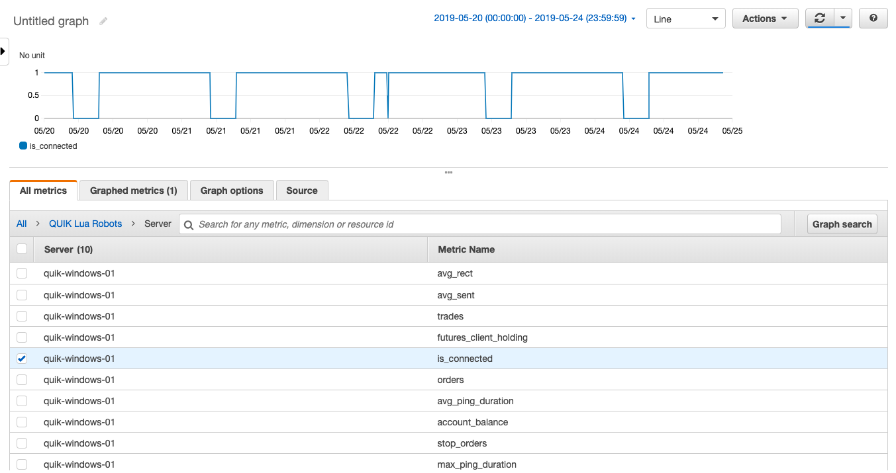

# quik-lua-heartbeat

It's just simple `lua` script to track what's going on with a [QUIK](https://arqatech.com/ru/products/quik/terminals/user-applications/quik-workstation/) trading terminal.
The script is to be run from inside QUIK so that it always knows what's happening.

The metrics file is meant to be polled by an external tool to write its updates
for subsequent analysis & alerts if something goes wrong
# Installation
1. Download this repo to the computer with QUIK to be monitored installed
2. Adjust the settings in `heartbeat.lua` if the default ones don't match your needs. This step is optional 
3. Launch the terminal
4. Run `heartbeat.lua` via `Services -> Lua scripts` as you would run any other `.lua` script
5. If everything works as expected you'd end up having some data written into `REPO_PATH\metrics\metrics.txt` where `REPO_PATH` is the folder you installed this repo into.
6. After that configure your monitoring system to pick up the data from this file 

# Metrics format
Here's an example of a single line written to the metrics file:
~~~~70:avg_sent:129278
1557650470:avg_ping_duration:0.093
1557650470:orders:32
1557650470:trades:39
1557650470:account_balance:0
1557650470:stop_orders:1
1557650470:futures_client_holding:1
1557650470:is_connected:1
1557650470:avg_rect:288
1557650470:max_ping_duration:0.281
~~~~

The format is as follows:
`<timestamp>:<key>:<value>\r\n`

* timestamp - UNIX timestamp indicating when the key/value was _collected_ by the script
* key - what's tracked
* value - the value for the respective key

# Configuration
The settings can be changed in the `heartbeat.lua` itself
* `METRICS_PATH` - where the metrics file needs to be written to
* `REWRITE_EVERY_N_RECORDS` - how often the metrics file needs to be truncated to avoid its infinite growth
* `SLEEP_PERIOD_MSEC` - the delay between metrics collection/writes. It's set to __1 minute__ by default. Feel free to set any meaningful value 

# Example
This is how it might look like when the metrics are dispatched to [Amazon CloudWatch](https://aws.amazon.com/ru/cloudwatch/):  

# How to use it with AWS
Please check out [this](https://github.com/ffeast/aws-metrics-sender) service - it solves exactly this problem on Windows boxes
